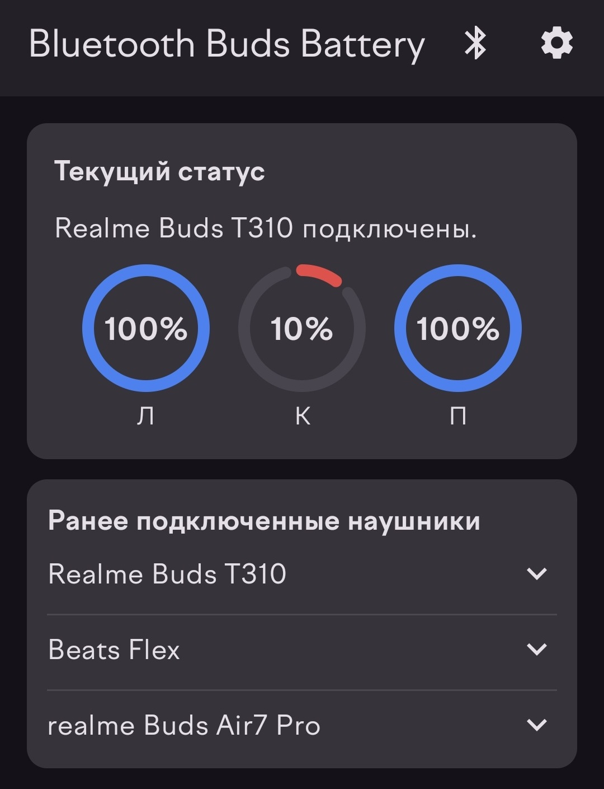
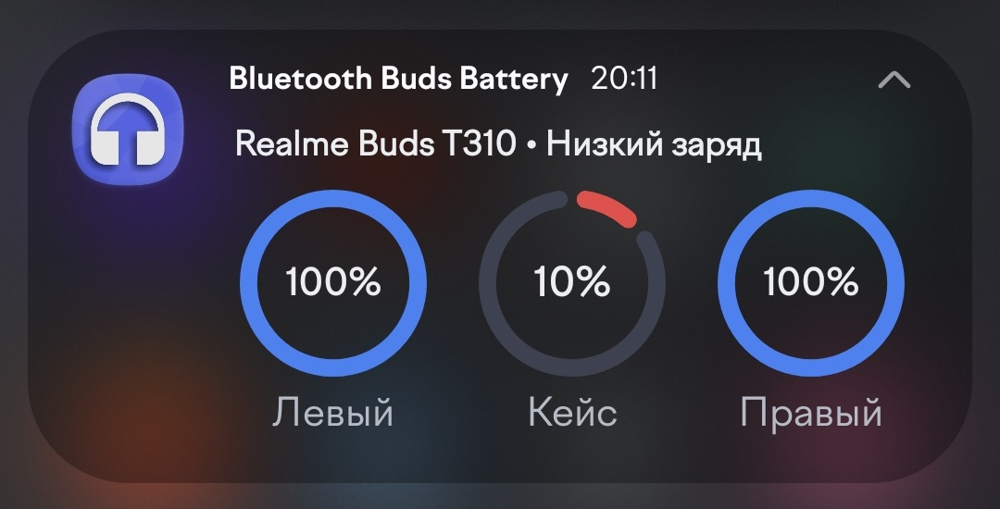
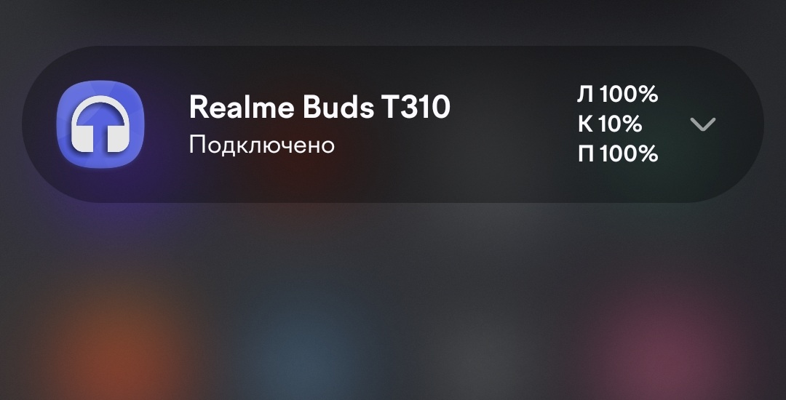

# Bluetooth Buds Battery

[English version](README.en.md)

Android-приложение для мониторинга заряда Bluetooth-наушников. Показывает общий заряд или раздельный заряд `L / R / Case`, если модель наушников передает такие данные.

## Возможности

- Отображение текущего заряда подключенных Bluetooth-наушников.
- Поддержка одиночного заряда `Battery` и раздельного заряда `Left / Right / Case`.
- Фоновый мониторинг подключений и обновлений заряда.
- Компактное и развернутое уведомление с круговыми индикаторами.
- Виджет рабочего стола в стиле развернутого уведомления.
- История ранее подключенных наушников с последним известным зарядом.
- Первоначальная настройка с пошаговым запросом разрешений.
- Настройки темы, языка и акцентного цвета.
- GitHub Actions workflow для release-сборки и публикации APK в GitHub Releases.

## Скриншоты

| Главный экран | Развернутое уведомление | Компактное уведомление |
| --- | --- | --- |
|  |  |  |

## Данные проекта

- Название приложения: `Bluetooth Buds Battery`
- Application ID: `com.laker.btbudsbattery`
- Минимальная версия Android: `minSdk = 31` / Android 12+
- Целевая версия Android: `targetSdk = 36`
- JDK: `17`
- Текущая версия: `1.1`

## Поддерживаемые источники заряда

Приложение использует несколько источников данных:

- стандартные Bluetooth-профили и системный уровень заряда;
- BLE advertisement/service data для отдельных TWS-моделей;
- Apple Continuity payload для AirPods и Beats;
- vendor events и Bluetooth audio device callbacks, где это доступно.

Поддержка раздельного `L / R / Case` зависит от модели наушников и от того, какие данные она передает Android. Если раздельные данные недоступны, приложение показывает одиночный заряд.

## Поддерживаемые модели

Проверенная и целевая поддержка:

- Realme Buds T310: `L / R / Case`.
- Apple AirPods 1 / 2 / 3.
- Apple AirPods Pro / Pro 2 / Pro 3.
- Apple AirPods Max.
- Beats X, Beats Flex, Beats Solo 3, Beats Studio 3, Beats Solo Pro, Beats Studio Pro, Beats Solo 4.
- Beats Fit Pro, Beats Studio Buds, Beats Studio Buds+, Beats Solo Buds.

Для Apple/Beats данные часто приходят крупными шагами, например по 10%, потому что так передается публично доступный BLE payload.

## Как добавить новую модель

Если ваша модель показывает заряд в системных настройках Android, но приложение не видит `L / R / Case`, нужны данные для анализа:

- модель наушников;
- версия Android и модель смартфона;
- скриншот системного экрана Bluetooth с корректным зарядом;
- `Bluetooth HCI Snoop Log`, если есть возможность его получить;
- лог приложения с тегами `BtBatteryRepo`, `BluetoothBatteryService`, `BluetoothConnectionReceiver`.

Новые TWS-парсеры добавляются модульно:

- общий контракт: `app/src/main/java/com/laker/btbudsbattery/data/parser/tws/TwsBatteryAdvertisementParser.kt`
- реестр: `app/src/main/java/com/laker/btbudsbattery/data/parser/tws/TwsBatteryParserRegistry.kt`
- пример модели: `app/src/main/java/com/laker/btbudsbattery/data/parser/tws/realme/RealmeT310FastPairParser.kt`

## Разрешения

Runtime-разрешения:

- `BLUETOOTH_CONNECT` — доступ к подключенным Bluetooth-устройствам.
- `BLUETOOTH_SCAN` — получение Bluetooth/BLE данных.
- `POST_NOTIFICATIONS` — показ уведомления мониторинга на Android 13+.
- `ACCESS_COARSE_LOCATION` и `ACCESS_FINE_LOCATION` — только Android 11 и ниже, где система связывает Bluetooth-сканирование с разрешением местоположения.

Manifest-only разрешения:

- `BLUETOOTH` и `BLUETOOTH_ADMIN` — только Android 11 и ниже.
- `FOREGROUND_SERVICE`.
- `FOREGROUND_SERVICE_CONNECTED_DEVICE`.

`BLUETOOTH_SCAN` объявлен с `android:usesPermissionFlags="neverForLocation"`.

## Сборка

Debug:

```powershell
.\gradlew.bat assembleDebug
```

Release:

```powershell
.\gradlew.bat assembleRelease
```

Release APK:

```text
app/build/outputs/apk/release/app-release.apk
```

Release-сборка включает R8 и shrink resources.

## Ограничения

- Не все Bluetooth-наушники передают раздельный заряд `L / R / Case`.
- На некоторых моделях заряд обновляется с задержкой или крупными шагами.
- Поведение фонового сервиса и уведомлений может отличаться на разных оболочках Android.
- Приложение не использует чтение уведомлений Google Fast Pair.

## Лицензия

Проект распространяется по лицензии **GNU General Public License v3.0**.
